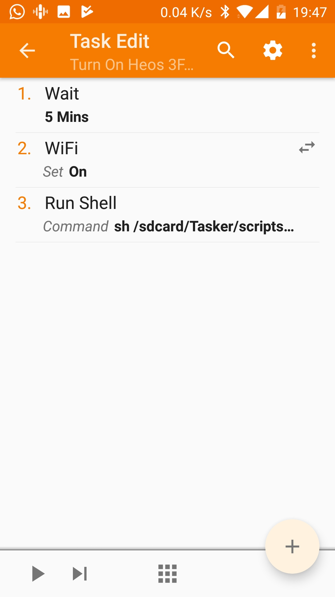
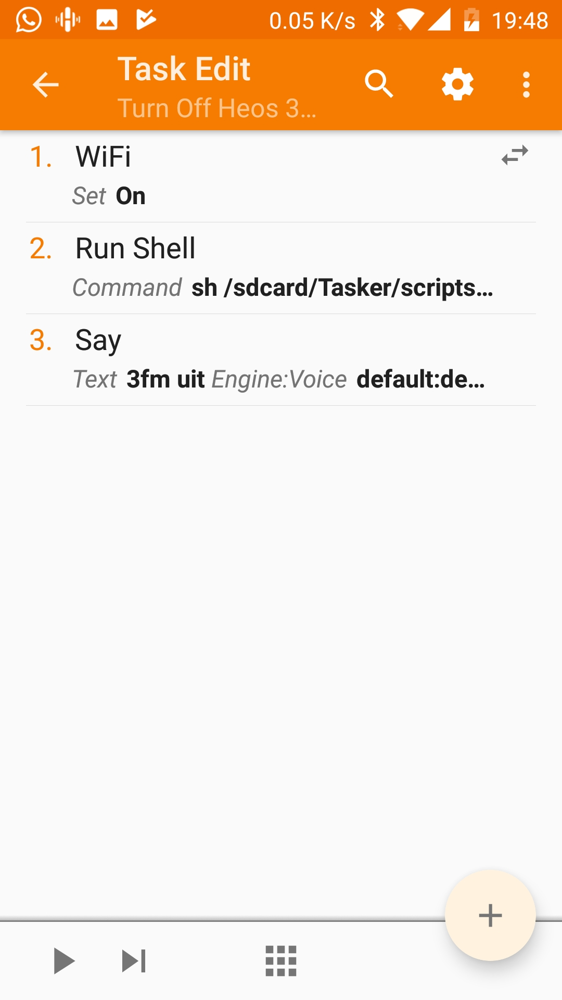
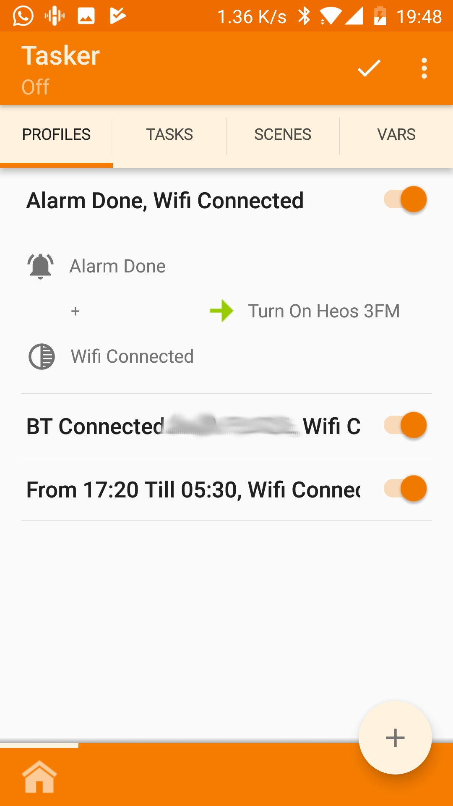
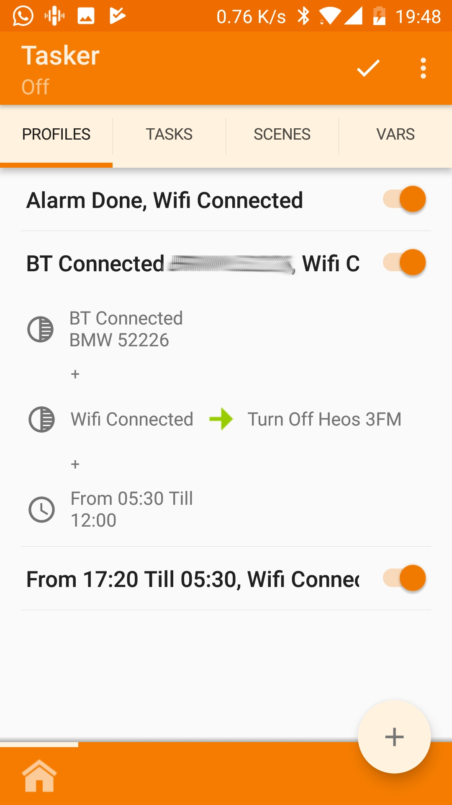

# Control a Denon Heos speaker with Tasker

I use this project to play play 3FM radio in the morning after waking up.
It stops playing when I drive away to work.

## Files

* **[heos.sh:](./heos.sh)** Communicates to the speaker and starts/stops playing music.

## Configuration

* **2 Tasks:**
  * Turn on the music: `sh /path/to/script/heos.sh play`
  
  * Turn off the music: `sh /path/to/script/heos.sh stop`
  

* **2 Profiles:**
  * Alarm done + Wifi connected --> Turn on the music
  
  * BT of car Connected + Wifi connected + in the morning --> Turn off the music
  

## Documentation

You need to play around with Telnet and the documentation in order to configure the script to whatever you like:

[HEOS CLI Protocol Specification](http://rn.dmglobal.com/euheos/HEOS_CLI_ProtocolSpecification.pdf)

Device configuration URL: `http://{{HEOS_IP}}/settings/index.html`
